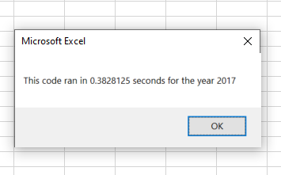
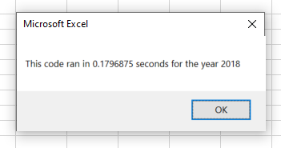

# stock-analysis
## Overview
### Background
Our original purpose was to assist Steve in analyzing DAQO stocks for his parents, who have decided to invest in the green energy company. 

The first analysis, performed soley on DAQO, shows it may not be a good stock investment for all of Steve's parents money. In 2018, DAQO return dropped almost 63%.

Steve was concerned his parents may need to diversify their investment and wants to have multiple green energy stocks analyzed to provide his parents with options. We provided this analysis to Steve by examining the total daily volume and yearly return for 12 different green energy companies,including DAQO, between 2017 and 2018. This analysis was performed using Visual Basic for Applications (VBA).

### Purpose
Because of DAQO's poor performance in 2018, Steve wants to recommend diversifying their investment to his parents. To do this, we refactored our VBA code.

This refactored code will analyze all the stock data which was previously compiled by Steve. Steve will still be able to compare the total daily volume and return for each stock.

## Results
Most companies saw a considerable decrease in their return between the years 2017 and 2018.

In 2017, all stocks had a positive return, except for TERP. For 2018, every stock reported a loss in their return except ENPH and RUN.

At first, the code to run the analysis on both years was a bit slower, both years taking approximately 0.77 seconds to execute. This is likely due to the nested loops causeing the code to have to run through the data set twice to reach the results.

After refactoring the code, execution time decreased to about 0.17 seconds for both years. 

## Summary
Refactoring code can reduce the execution time and make the macro more efficient. This can lead to getting results faster. It can also make the code more organized and readable.

However, refactoring code can also lead to a delayed execution time or even having the macro not run at all if the person refactoring does not have proper understanding of the the code they are trying to refactor.

The refactored VBA code analyzed data faster while still providing the same results. The refactored code, in my opinion, laid out the steps in a more concise manner making it easier to maintain and debug, should the need arise.
